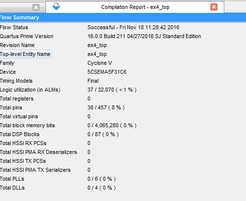
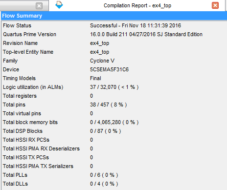

[Main readme](../readme.MD) | [Part one](../part_1) | [Part two](../part_2) | [Part three](../part_3) | [Part four](../part_4)

# Experiment 1 - Complete the schematic design of a hex to 7 segment decoder

* First programmed FPGA with provided solution - needed to delete the redundant processor entry in the programming chain.
* Implemented out[4] of 7seg_decoder using schematic, leaving optimisation of truth table to Quartus.
* Assigned pins in pin planner manually after running Analysis and Elaboration.
* Compiled project and programmed FPGA with our .sof file, tested the output.
* Examined resources used:

	+-----------------------------------------------------------------------------------+
	; Flow Summary                                                                      ;
	+---------------------------------+-------------------------------------------------+
	; Flow Status                     ; Successful - Fri Nov 18 09:59:20 2016           ;
	; Quartus Prime Version           ; 16.0.0 Build 211 04/27/2016 SJ Standard Edition ;
	; Revision Name                   ; ex1_top                                         ;
	; Top-level Entity Name           ; ex1_top                                         ;
	; Family                          ; Cyclone V                                       ;
	; Device                          ; 5CSEMA5F31C6                                    ;
	; Timing Models                   ; Final                                           ;
	; Logic utilization (in ALMs)     ; 4 / 32,070 ( < 1 % )                            ;
	; Total registers                 ; 0                                               ;
	; Total pins                      ; 11 / 457 ( 2 % )                                ;
	; Total virtual pins              ; 0                                               ;
	; Total block memory bits         ; 0 / 4,065,280 ( 0 % )                           ;
	; Total DSP Blocks                ; 0 / 87 ( 0 % )                                  ;
	; Total HSSI RX PCSs              ; 0                                               ;
	; Total HSSI PMA RX Deserializers ; 0                                               ;
	; Total HSSI TX PCSs              ; 0                                               ;
	; Total HSSI PMA TX Serializers   ; 0                                               ;
	; Total PLLs                      ; 0 / 6 ( 0 % )                                   ;
	; Total DLLs                      ; 0 / 4 ( 0 % )                                   ;
	+---------------------------------+-------------------------------------------------+

### TimeQuest Timing Analyzer Report
Delay difference: 85C is around 0.5ns slower than 0C, this is because at higher temperatures resistance in the circuit increases, slowing down current flow. See [spreadsheet](./ex_1/datasheet_diff.csv)

https://www.youtube.com/watch?v=798pyNVvAus

# Experiment 2 - Create hex to 7-segment decoder using Hardware Design Language (HDL) Verilog
* [hex_to_7seg.v](./ex_2/hex_to_7seg.v)
* Use `always` block to trigger whenever the input changes `always @ (*)`
* Use `case(input)` to choose the output depending on the value of the input
* Note that display is active low
* Create a [ex2_top.v](./ex_2/ex2_top.v) as Top-Level entity to connect up all the inputs and outputs
* Copy the pin assignments file into .qsf (Quartus Settings File) - much quickers than manually assigning pins.

# Experiment 3 - display 10-bit binary switch input on the 7-segment displays
* Changed top level Verilog file [ex3_top.v](./ex_3/ex3_top.v) to use three of the hex_to_7seg modules created earlier.
* Used all of the switches as input
* Compiled and tested

VIDEO LINK

# Experiment 4 - display 10-bit binary switch input as BCD on the 7-segment displays

* Compiling using 16-bit version uses exactly the same resources as compiling using the 10-bit verison of the bin2bcd converter!

Compiled using 10-bit BCD
--------------------------------

Compiled using 16-bit BCD
--------------------------------

