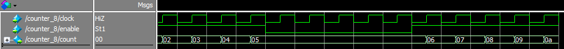

[Main readme](../readme.MD) | [Part one](../part_1) | [Part two](../part_2) | [Part three](../part_3) | [Part four](../part_4)

# Objective of Lab

* Learn how to design counters and simple FSMs.
* Explore multistage cascade counters.

# Experiment 5 - Designing a counter (and testing using Quartus Simulation Tools)
* Created new project and [counter_8.v](./ex_5/counter_8.v). The Verilog code for the latter simply assigns the value of count to the current value plus one at every rising edge of the clock, if enable is asserted.
* Compiled the file, then tested the counter through ModelSim. Firstly by entering commands in the transcript window, then by using a .do script [tb_counter.do](./ex_5/simulation/modelsim/tb_counter.do), in both cases producing the waveform displayed below.

### Simulated Waveform

# Experiment 6 - Implementing the counter on DE0 (and cascading counters to make it human-detectable)
* [ex6_top.v](./ex_6/ex6_top.v), [modulo_counter_16.v](./ex_6/modulo_counter_16.v) is used for the cascade counter part.
* Error with compiler needed space after .sdc code

`create_clock -name "CLOCK_50" -period 20.000ns [get_ports {CLOCK_50}]`

* The .sdc code specifies timing constraints for the port CLOCK_50, which makes the simulation more detailed and reliable.
* The 16-bit counter functions, but increments at far too fast a rate to be visible (20MHz).
* Hence the modulo counter above is needed to divide the clock by 50000 in a counter cascade
* This enables the main counter for one clock cycle every millisecond, resulting in it counting at that rate when key 0 is held.

### Demonstration Video
https://youtu.be/IQr87eGyIXI

## TimeQuest Timing Analyzer - Maximum clock frequency
1. What are the predicted maximum frequencies for this circuit under the highest and lowest temperatures?

  * Lowest temperature: 422.65 MHz
  * Highest temperature: 444.84 MHz

2. What are the other interesting timing data that you can discover with these reports?
  
  * Worst-case Setup and Hold time slack details - The more slack there is, the more allowance there is to increase the speed of the clock. 
  * Metastability Summary - Tells us whether there are any metastability problems due to asynchronous relationships, or violated setup/hold times.
  * Minimum Pulse Width - Signifies how big the pulses on the clocks must be in order for the design to work. Useful for tick generators.
  * Input Transition Times - Or _skew_, how long does the input take to go from Vmin to Vmax.

3. Why is the TimeQuest entry red, indicating that there may be a problem?

  * The entry is red because data specifying timing constraints is not available for a number of the user-specified inputs.

## FPGA resources
### Explain results:

|Metric|Numbers|
|---|---|
Logic utilization (in ALMs)|37/32,070 (< 1%)
Total registers|0
Total pins|38/457 (8%)
Total block memory bits|0/4,065,280 (0%)
Total DSP blocks|0/87 (0%)
Total PLLS|0
Total DLLS|0

* An ALM is an adaptive logic module. These are the basic programmable logic elements within the FPGA that can be configured as required. Only a tiny proportion of the device is required for this design.
* Registers are a form of memory comprised of an array of flip-flops. Zero appear to be required for design.
* Pins refer to the array of nodules on the bottom of the chip package that connect it to the DE1 board, a small percentage are required for this design.
* The block memory bits are the main on-chip memory, none are used here.
* DSP blocks are used for rapid digital signals processing through specific pathways provided by the hardware designer, none are used here.
* PLLs are phase-locked loops, not in use here.
* DLLs are delay-locked loops, not in use here.

# Experiment 7 - Creating a PRBS (Pseudo-Random Bit Sequence) using a LFSR (Linear Feedback Shift Register)
* Manual calculation of the first 10 numbers in the 7-bit LFSR implementing polynomial `1 + X^3 + X^7`

|Q6|Q5|Q4|Q3|Q2|Q1|Q0|count|
|---|---|---|---|---|---|---|---|
0|0|0|0|0|0|1|1
0|0|0|0|0|1|1|3
0|0|0|0|1|1|1|7
0|0|0|1|1|1|1|15
0|0|1|1|1|1|1|31
0|1|1|1|1|1|1|63
1|1|1|1|1|1|1|(1)27
1|1|1|1|1|1|0|(1)26
1|1|1|1|1|0|1|(1)25
1|1|1|1|0|1|0|(1)22

### Demonstration Video
https://youtu.be/6i-C9znA6I8

# Experiment 8 - Creating a starting line delay circuit
### Design

* A 16-bit LFSR is used in this experiment.
* 16 bits are also used within the delay module.

### State Diagram

Default state: Turn on another LED, increment state

|State descr|State|Input required for next state|Output|
|---|---|---|---|
|Wait| 0  | trigger=0 (active low)  | en_lfsr = 1, state = 1 |
|Start delay| 11 | tick_hs | en_lfsr = 0, start_delay = 1 |
|Wait delay| 12 | timeout=1 | start_delay = 0 |
|LED OFF| 13 | tick_hs | LEDR[9:0] = 0 |

### Demonstration Video
https://youtu.be/qhqajR2W9S0

## Second clock divider should divide by 500 instead of 2500
- 50MHz / 50000 = 1000Hz (1ms period)
- 1000Hz / 2500 = 0.4Hz (2.5s period)
- 1000Hz / 500 = 2Hz (0.5s period)

# Experiment 9 - Modify experiment 8 to create a Reaction Meter
- Create a new module named timer_16 clocked with 1ms clock
- Modify FSM to add a new output to start the timing
- Display timer_16 output on HEX diplay when it has been stopped

### Demonstration Video
https://youtu.be/H1HPmvCAX7I

