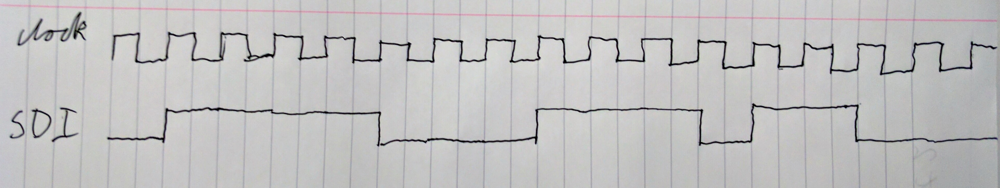

[Main readme](../readme.MD) | [Part one](../part_1) | [Part two](../part_2) | [Part three](../part_3) | [Part four](../part_4)

# Experiment 10 - Interface with the MCP4911 Digital-to-Analogue Converter

* Purpose of each pin on the DAC (page 17).
* How information is sent to the DAC through the SDI (pages 23-24).
* How to configure the DAC's internal functions (page 25).
* DAC's timing specification and timing diagram (pages 4 and 7)

[Datasheet](./MCP49x1.pdf)

### Predicted Timing Diagram

### Timing diagram from Altera ModelSim 

### TP9 Zero

### TP9 10'h3ff

### TP3 and TP1 for 10'h23b

# Experiment 11 - D-to-A conversion using pulse-width modulation

* Output voltages at TP8 and TP9 are essentially the same.
* TP8 is TP5 but with the high frequency components removed.
* TP5 is the PWM signal.

### Demonstration Video
https://youtu.be/4DqFP13b3SI

# Experiment 12 - Designing and testing a sinewave table in ROM

1. Initialize ROM using rom_data.mif file generated with Matlab or Python code.
2. Use switches to specify and access specific areas of the ROM and check the data is correct - it was.

./rom_data.mif

# Experiment 13 - A fixed frequency sinewave generator

1. 10Hz period because getting a sample every 10kHz and have 1K samples for one cycle

# Experiment 14 - A variable sinewave generator

1. When switch value is 0, the counter won't count at all.
2. When switch value is 1, the frequency will be 10Hz as before.
3. When switch value is 2, the frequency will be 20Hz, because the counter will increment by 2.

* An equation for the frequency therefore is: `Switch value * 10Hz`

### Demonstration Video
https://youtu.be/4RnDzHfP_hM

# Experiment 15 - Using the A-to-D convertor to adjust the frequency of the sinewave

1. Make sure to specify the ADC to use channel 0, which is the potentiometer.
2. Use data_from_adc instead of switches as input for the counter.

* When value from the potentiometer gets too high, a sinewave of a lower frequency is generated because the count wraps around.

### Demonstration Video
https://youtu.be/W-exvCPd3aY